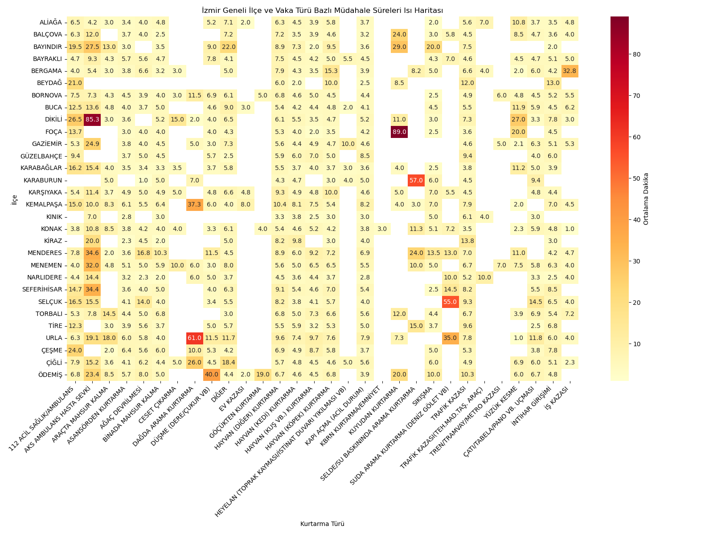
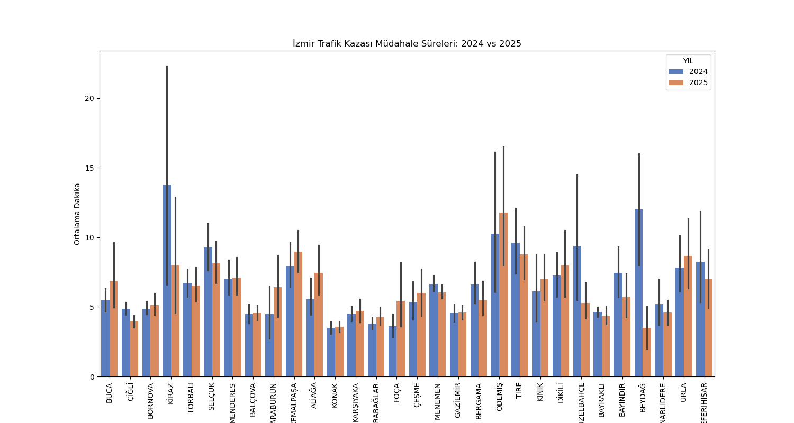
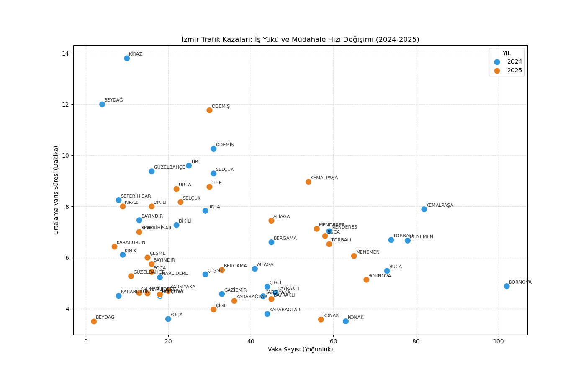

# İzmir İtfaiyesi Vaka ve Müdahale Analizi (2024-2025)

Bu proje, İzmir İtfaiyesi'nin 2024 ve 2025 yıllarına ait arama kurtarma ve trafik kazası müdahale verilerini inceleyen kapsamlı bir veri bilimi çalışmasıdır. Veri seti üzerinden müdahale süreleri, vaka yoğunlukları ve kurtarma türleri analiz edilmiş; ayrıca makine öğrenmesi teknikleri kullanılarak varış süresi tahmin modeli geliştirilmiştir.

Veri ön işleme ve keşifçi veri analizi (EDA) süreçlerinde Pandas ve NumPy kullanılmıştır. Elde edilen bulgular Matplotlib ve Seaborn ile görselleştirilmiş, itfaiyenin iş yükü ve müdahale hızı haritalandırılmıştır. Trafik kazalarına müdahale sürelerini tahmin etmek amacıyla scikit-learn kütüphanesi üzerinden Random Forest Regressor algoritması kurularak modelin hata payı (MAE) hesaplanmıştır.

Proje kapsamında yer alan dosyalar şunlardır:

- analiz-son.ipynb: Genel veri birleştirme, ön işleme ve kapsamlı analiz adımları.
- itfaiye-analiz.ipynb / Itfaiye.ipynb: İlçelere ve mahallelere göre vaka dağılımları ile varış sürelerinin detaylı incelemesi.
- trafik-kazalari-mudahale-analizi.ipynb: Trafik kazası verilerine odaklanarak makine öğrenmesi ile müdahale süresi tahmini yapılması.

## Görsel Çıktılar

Aşağıda analiz sürecinde elde edilen bazı temel görselleştirmeleri inceleyebilirsiniz:

### Görsel Çıktılar ve Değerlendirmeler

- Vaka Yoğunluk Analizi: İzmir genelindeki itfaiye müdahalelerinin bölgesel dağılımını ve iş yükü yoğunluğunu göstermektedir. Bu harita, en çok vaka yaşanan ilçeleri belirlemek ve kaynak planlamasına ışık tutmak amacıyla oluşturulmuştur.

- Müdahale Türlerine Göre Dağılım: İtfaiye ekiplerinin 2024-2025 yılları arasında müdahale ettiği olayların (trafik kazası, hayvan kurtarma, kapı açma vb.) oransal dağılımını yansıtmaktadır. Ekiplerin en çok hangi vaka tiplerine efor sarf ettiğini net bir şekilde ortaya koyar.

## Teknolojiler ve Kütüphaneler

Python, Pandas, NumPy, Matplotlib, Seaborn, Scikit-learn

## Veri Kaynağı

Bu projede kullanılan veri setleri, İzmir Büyükşehir Belediyesi Açık Veri Portalı üzerinden temin edilmiştir. Çalışmada yer alan analizler ve modellemeler, İzmir İtfaiyesi'nin 2024 ve 2025 yıllarına ait AKS112 Arama Kurtarma vakaları müdahale istatistikleri baz alınarak gerçekleştirilmiştir.

Veri setinin orijinal haline ve detaylarına aşağıdaki bağlantıdan ulaşabilirsiniz:
[İzmir İtfaiyesi AKS112 Arama Kurtarma Vakaları Müdahale İstatistiği](https://acikveri.bizizmir.com/dataset/izmir-itfaiyesi-aks112-arama-kurtarma-vakalari-mudahale-istatistigi)
