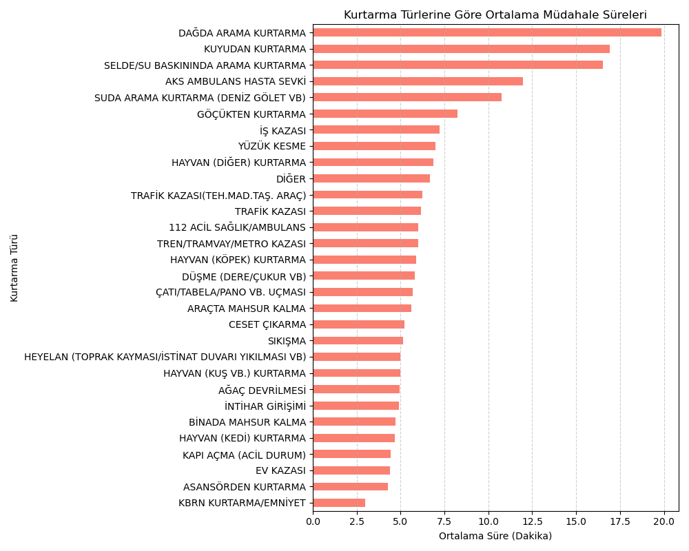

# İzmir İtfaiyesi Vaka ve Müdahale Analizi (2024-2025)

Bu proje, İzmir İtfaiyesi'nin 2024 ve 2025 yıllarına ait arama kurtarma ve trafik kazası müdahale verilerini inceleyen kapsamlı bir veri bilimi çalışmasıdır. Veri seti üzerinden müdahale süreleri, vaka yoğunlukları ve kurtarma türleri analiz edilmiş; ayrıca makine öğrenmesi teknikleri kullanılarak varış süresi tahmin modeli geliştirilmiştir.

Veri ön işleme ve keşifçi veri analizi (EDA) süreçlerinde Pandas ve NumPy kullanılmıştır. Elde edilen bulgular Matplotlib ve Seaborn ile görselleştirilmiş, itfaiyenin iş yükü ve müdahale hızı haritalandırılmıştır. Trafik kazalarına müdahale sürelerini tahmin etmek amacıyla scikit-learn kütüphanesi üzerinden Random Forest Regressor algoritması kurularak modelin hata payı (MAE) hesaplanmıştır.

Proje kapsamında yer alan dosyalar şunlardır:
* analiz-son.ipynb: Genel veri birleştirme, ön işleme ve kapsamlı analiz adımları.
* itfaiye-analiz.ipynb / Itfaiye.ipynb: İlçelere ve mahallelere göre vaka dağılımları ile varış sürelerinin detaylı incelemesi.
* trafik-kazalari-mudahale-analizi.ipynb: Trafik kazası verilerine odaklanarak makine öğrenmesi ile müdahale süresi tahmini yapılması.

## Görsel Çıktılar

Aşağıda analiz sürecinde elde edilen bazı temel görselleştirmeleri inceleyebilirsiniz:

## Teknolojiler ve Kütüphaneler
Python, Pandas, NumPy, Matplotlib, Seaborn, Scikit-learn